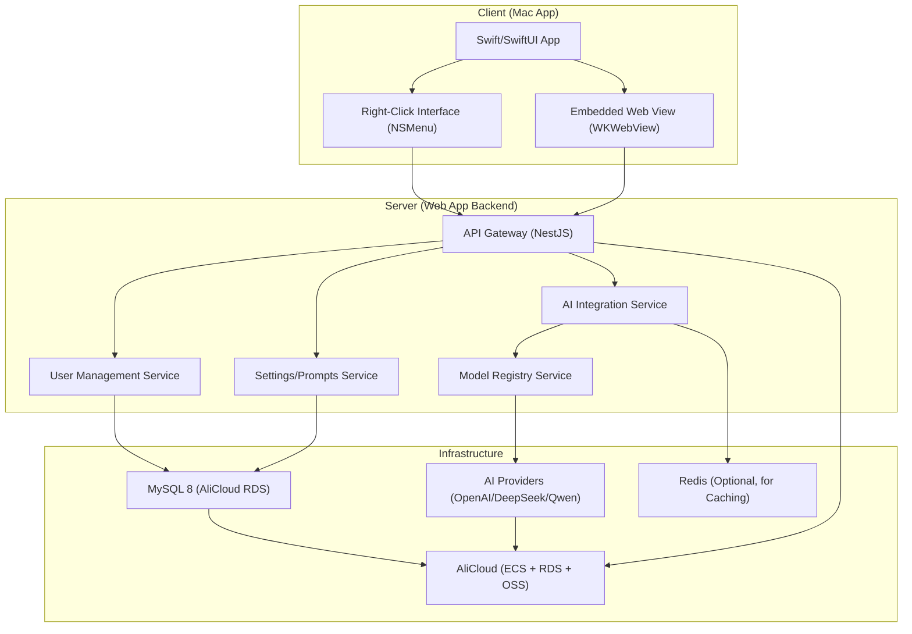

# Pen Docs
## Product information
Pen is an AI powered product that helps you to write better.
It has a Mac app as the front end, and a web app as the backend.
The Mac app has two main interface:
1. The management interface, embedded in the app, you can use the web app to manage your settings.
2. The right-click interface, where you can use the AI to help you write better.
The Web app will be hosted on AliCloud. It is to manage your account settings such as your API key, your writing style, and your prompts etc. The Web app will be embedded in the Mac app, so you can use it to manage your account settings without needing to open a browser.

## Architecture

### Tech Stack

| Component | Technology | Rationale |
|-----------|------------|-----------|
| **Mac App (Frontend)** | Swift + SwiftUI | Native Mac development with modern UI; integrates with macOS right-click menus. |
| **Web View (Embedded Management UI)** | WKWebView | Built-in macOS component to embed the web app’s management interface. |
| **Web App (Frontend)** | React + TypeScript | Dynamic, responsive UI; TypeScript for type safety. |
| **Backend API** | Node.js (NestJS) + TypeScript | Scalable, modular backend with built-in dependency injection; ideal for service-oriented architecture. |
| **Database** | MySQL 8 (AliCloud RDS) | Structured schema for user accounts, settings, and AI model configurations. |
| **AI Integration** | Multi-Provider Client (OpenAI/DeepSeek/Qwen) | Abstracted service to support multiple AI models with unified interface. |
| **Cloud Hosting** | AliCloud (ECS + RDS + OSS) | ECS for web app deployment, RDS for managed MySQL, OSS for optional storage. |
| **Authentication** | JWT | Stateless auth for secure API access from the Mac app. |

### Architecture Diagram



### Key Architectural Updates

1. **MySQL 8 Integration (AliCloud RDS)**  
   - Structured schema for user accounts, settings, AI model configurations, and API keys
   - Managed RDS service for reliability and scalability

2. **Multi-AI Provider Integration**  
   - Abstracted AI Integration Service with unified interface
   - Model Registry Service to support multiple models (GPT-4o-mini, DeepSeek 3.2, Qwen-Plus)
   - Extensible architecture for adding new AI models in the future

3. **Security Enhancements**  
   - Encrypted AI provider API keys stored in MySQL
   - JWT authentication for secure API access
   - Rate limiting to prevent AI API abuse

4. **Performance Optimizations**  
   - Optional Redis caching for frequent AI responses
   - Modular service architecture for independent scaling

5. **Internationalization (i18n) Support**  
   - All UI text stored in resource files for easy language switching
   - Mac App: String Catalogs (SwiftUI) for native localization
   - Web App: i18next or react-i18next for dynamic language support
   - Language preference stored in user settings for personalized experience

### Data Flow Example (AI Request)

1. **User Triggers AI Help**  
   - Mac app right-click interface sends request with user ID, selected text, target AI model, and prompt template ID

2. **Backend Processing**  
   - API Gateway validates JWT and routes to AI Integration Service
   - AI Integration Service fetches encrypted API key, prompt template, and uses Model Registry to select correct client

3. **Response & Storage**  
   - AI provider returns generated text
   - Response cached (if applicable)
   - Backend sends response to Mac app
   - Mac app displays AI-generated text

### Database Schema Snippets

```sql
-- Users Table
CREATE TABLE users (
    id INT PRIMARY KEY AUTO_INCREMENT,
    email VARCHAR(255) UNIQUE NOT NULL,
    password_hash VARCHAR(255) NOT NULL,
    created_at TIMESTAMP DEFAULT CURRENT_TIMESTAMP,
    updated_at TIMESTAMP DEFAULT CURRENT_TIMESTAMP ON UPDATE CURRENT_TIMESTAMP
);

-- User Settings Table
CREATE TABLE user_settings (
    id INT PRIMARY KEY AUTO_INCREMENT,
    user_id INT REFERENCES users(id),
    default_ai_model VARCHAR(50) NOT NULL, -- e.g., 'gpt-4o-mini'
    writing_style JSON NOT NULL, -- e.g., {"tone": "professional", "length": "medium"}
    created_at TIMESTAMP DEFAULT CURRENT_TIMESTAMP,
    updated_at TIMESTAMP DEFAULT CURRENT_TIMESTAMP ON UPDATE CURRENT_TIMESTAMP
);

-- AI Models Table
CREATE TABLE ai_models (
    id INT PRIMARY KEY AUTO_INCREMENT,
    model_name VARCHAR(50) UNIQUE NOT NULL, -- e.g., 'deepseek-3.2'
    provider VARCHAR(50) NOT NULL, -- e.g., 'deepseek'
    endpoint VARCHAR(255) NOT NULL, -- API endpoint
    default_params JSON NOT NULL, -- e.g., {"temperature": 0.7}
    is_active BOOLEAN DEFAULT TRUE,
    created_at TIMESTAMP DEFAULT CURRENT_TIMESTAMP
);

-- API Keys Table (Encrypted)
CREATE TABLE api_keys (
    id INT PRIMARY KEY AUTO_INCREMENT,
    user_id INT REFERENCES users(id),
    provider VARCHAR(50) NOT NULL, -- e.g., 'openai'
    encrypted_key VARCHAR(255) NOT NULL, -- AES-256 encrypted
    created_at TIMESTAMP DEFAULT CURRENT_TIMESTAMP,
    updated_at TIMESTAMP DEFAULT CURRENT_TIMESTAMP ON UPDATE CURRENT_TIMESTAMP
);

-- Prompts Table
CREATE TABLE prompts (
    id INT PRIMARY KEY AUTO_INCREMENT,
    user_id INT REFERENCES users(id),
    name VARCHAR(100) NOT NULL,
    content TEXT NOT NULL,
    is_default BOOLEAN DEFAULT FALSE,
    created_at TIMESTAMP DEFAULT CURRENT_TIMESTAMP
);
```

### Deployment Strategy

| Service | AliCloud Component | Configuration |
|---------|-------------------|---------------|
| **Web App Backend** | ECS (Elastic Compute Service) | Dockerized deployment with auto-scaling; load balancer for high availability. |
| **Database** | RDS (Relational Database Service) | MySQL 8.0; multi-AZ deployment for redundancy; read replicas for scaling reads. |
| **Optional Caching** | Redis (AliCloud MemoryDB) | Managed Redis for caching AI responses and user settings. |
| **Storage** | OSS (Object Storage Service) | Optional: Store user-uploaded files (e.g., documents for AI analysis). |
| **Security** | WAF (Web Application Firewall) + SSL | Protect API endpoints; HTTPS for all communications. |