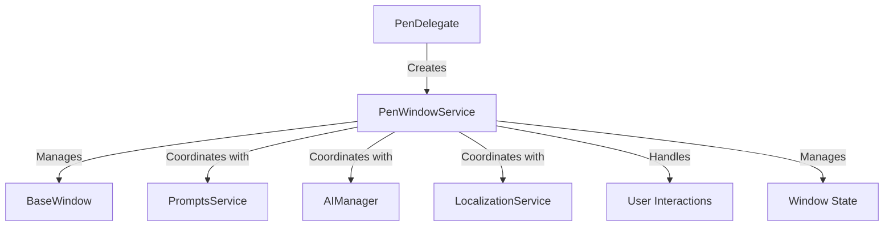
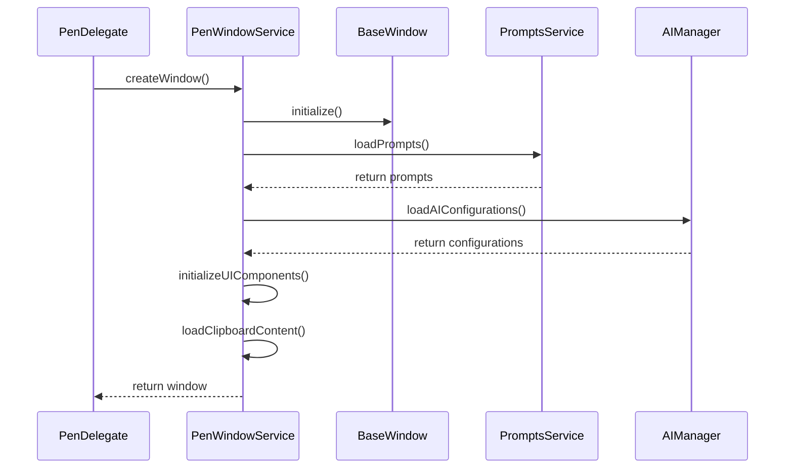
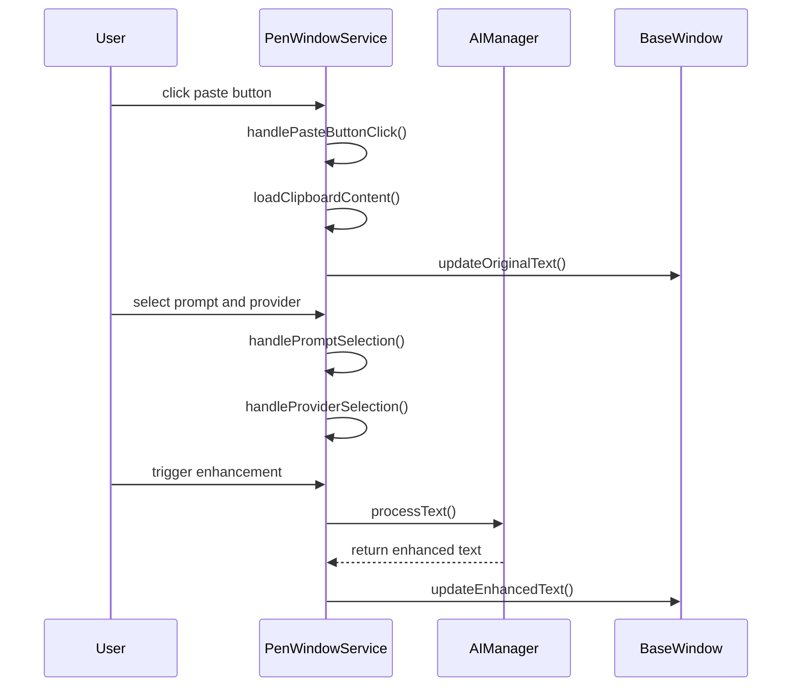
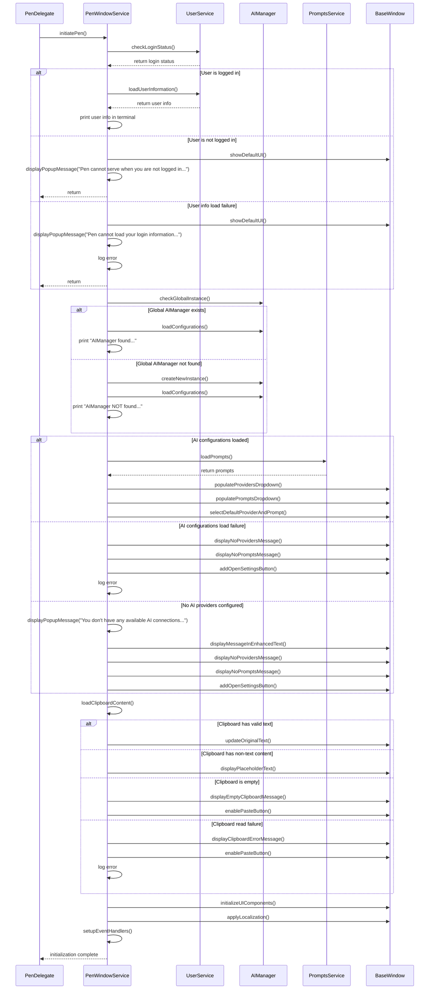
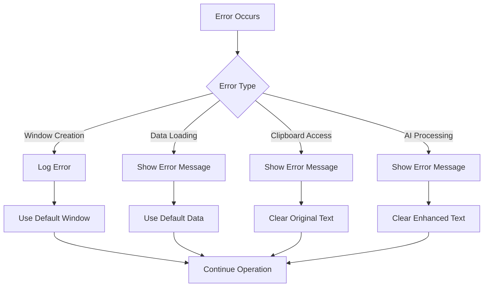

# PenWindowService Design Document

## 1. Overview

PenWindowService is a dedicated service responsible for managing all behaviors and lifecycle events of the Pen application window. It provides a centralized interface for window creation, positioning, state management, and interaction handling. This service abstracts window-related functionality from the main application logic, promoting separation of concerns and improving maintainability.

## 2. Architecture

### 2.1 System Context



### 2.2 Component Structure

- **PenWindowService**: Core service managing window operations
- **BaseWindow**: Custom window class extending NSWindow
- **WindowState**: Struct holding window state information
- **PenDelegate**: Application delegate that initializes the service

## 3. Responsibilities

### 3.1 Core Responsibilities

1. **Window Lifecycle Management**
   - Create and destroy Pen application window
   - Handle window show/hide operations
   - Manage window state persistence

2. **Window Positioning**
   - Position window relative to menu bar icon
   - Position window relative to mouse cursor
   - Clamp window to screen bounds

3. **UI Component Management**
   - Initialize and configure all UI components
   - Manage component states
   - Handle component interactions

4. **Data Integration**
   - Load user prompts from PromptsService
   - Load AI configurations from AIManager
   - Handle clipboard operations

5. **Event Handling**
   - Handle user interactions
   - Respond to system events
   - Manage keyboard shortcuts

6. **Localization**
   - Apply localized strings to UI components
   - Handle language changes

7. **Error Handling**
   - Handle window-related errors
   - Display appropriate error messages

## 4. Key Components

### 4.1 PenWindowService

```swift
class PenWindowService {
    static let shared = PenWindowService()
    
    private var window: BaseWindow?
    private var windowState: WindowState
    
    // Initialization
    private init() {}
    
    // Window lifecycle methods
    func createWindow() -> BaseWindow
    func showWindow()
    func hideWindow()
    func toggleWindow()
    
    // Positioning methods
    func positionWindowRelativeToMenuBarIcon()
    func positionWindowRelativeToMouseCursor()
    func clampWindowToScreen()
    
    // UI management methods
    func initializeUIComponents()
    func updateUIComponents()
    
    // Data loading methods
    func loadPrompts()
    func loadAIConfigurations()
    func loadClipboardContent()
    
    // Event handling methods
    func handlePasteButtonClick()
    func handlePromptSelection()
    func handleProviderSelection()
    
    // Initialization method
    func initiatePen() async
}
```

### 4.2 WindowState

```swift
struct WindowState {
    var isVisible: Bool
    var lastPosition: NSPoint
    var selectedPromptId: String?
    var selectedProviderId: String?
    var originalText: String
    var enhancedText: String
    
    mutating func updateState()
    func saveState()
    static func loadState() -> WindowState
}
```

## 5. Data Flow

### 5.1 Window Creation Flow



### 5.2 User Interaction Flow



### 5.3 InitiatePen Flow



## 6. Methods

### 6.1 Window Lifecycle Methods

| Method | Description | Parameters | Return Value |
|--------|-------------|------------|--------------|
| `createWindow()` | Creates a new Pen window | None | `BaseWindow` |
| `showWindow()` | Shows the Pen window | None | `Void` |
| `hideWindow()` | Hides the Pen window | None | `Void` |
| `toggleWindow()` | Toggles window visibility | None | `Void` |
| `closeWindow()` | Closes the Pen window | None | `Void` |

### 6.2 Positioning Methods

| Method | Description | Parameters | Return Value |
|--------|-------------|------------|--------------|
| `positionWindowRelativeToMenuBarIcon()` | Positions window near menu bar icon | None | `Void` |
| `positionWindowRelativeToMouseCursor()` | Positions window near mouse cursor | None | `Void` |
| `clampWindowToScreen()` | Ensures window stays within screen bounds | None | `Void` |

### 6.3 UI Management Methods

| Method | Description | Parameters | Return Value |
|--------|-------------|------------|--------------|
| `initializeUIComponents()` | Initializes all UI components | None | `Void` |
| `updateUIComponents()` | Updates UI components with current data | None | `Void` |
| `updateOriginalText(_:)` | Updates original text field | `String` | `Void` |
| `updateEnhancedText(_:)` | Updates enhanced text field | `String` | `Void` |
| `updatePromptDropdown(_:)` | Updates prompt dropdown with new data | `[Prompt]` | `Void` |
| `updateProviderDropdown(_:)` | Updates provider dropdown with new data | `[AIProvider]` | `Void` |

### 6.4 Data Loading Methods

| Method | Description | Parameters | Return Value |
|--------|-------------|------------|--------------|
| `loadPrompts()` | Loads prompts for current user | None | `[Prompt]` |
| `loadAIConfigurations()` | Loads AI configurations | None | `[AIProvider]` |
| `loadClipboardContent()` | Loads content from system clipboard | None | `String?` |

### 6.5 Event Handling Methods

| Method | Description | Parameters | Return Value |
|--------|-------------|------------|--------------|
| `handlePasteButtonClick()` | Handles paste button click event | None | `Void` |
| `handlePromptSelection(_:)` | Handles prompt selection change | `String` (prompt ID) | `Void` |
| `handleProviderSelection(_:)` | Handles provider selection change | `String` (provider ID) | `Void` |
| `handleEnhanceButtonClick()` | Handles enhance button click event | None | `Void` |

### 6.6 Initialization Method

| Method | Description | Parameters | Return Value |
|--------|-------------|------------|--------------|
| `initiatePen()` | Initializes Pen window according to user stories | None | `Void` |

#### InitiatePen Method Details

The `initiatePen()` method is the core initialization method that implements all the acceptance criteria from the Pen Initialization user stories. It performs the following steps:

1. **Load User Information**
   - Check if user is logged in and app is in online-login mode
   - Load user information including account settings, preferences, and usage history
   - Print user information in terminal
   - Handle online-logout mode by displaying default UI and popup message
   - Handle user information load failure by displaying error message

2. **Load AI Configurations**
   - Check if global AIManager object is available
   - Load AI configurations from global AIManager if available
   - Create new AIManager as fallback if global object is not available
   - Populate AI providers drop-down box
   - Populate prompts drop-down box with user's predefined prompts
   - Select user's default AI provider and prompt
   - Print initialization status in terminal
   - Handle AI configuration load failure
   - Handle no AI providers configured scenario

3. **Process Clipboard Content**
   - Read most recent text from system clipboard
   - Paste valid text into pen_original_text_text text field
   - Handle non-text clipboard content
   - Handle empty clipboard scenario
   - Handle clipboard read failure

4. **UI Initialization**
   - Initialize all UI components
   - Update UI with loaded data
   - Set up event handlers
   - Apply localization

5. **Error Handling**
   - Log errors for troubleshooting
   - Display appropriate error messages
   - Use fallback mechanisms when needed

## 7. Integration Points

### 7.1 External Services

- **PromptsService**: Loads user prompts and manages prompt-related operations
- **AIManager**: Handles AI-related operations and text enhancement
- **LocalizationService**: Provides localized strings for UI components
- **WindowManager**: Provides popup message functionality

### 7.2 Application Delegate

- **PenDelegate**: Initializes and coordinates with PenWindowService
- **ShortcutService**: Triggers window toggle via keyboard shortcuts

### 7.3 UI Components

- **BaseWindow**: Custom window class managed by PenWindowService
- **NSTextField**: Text fields for original and enhanced text
- **NSPopUpButton**: Dropdowns for prompts and providers
- **NSButton**: Paste and enhance buttons

## 8. Error Handling

### 8.1 Error Types

| Error Type | Description | Handling Strategy |
|------------|-------------|-------------------|
| `WindowCreationError` | Failed to create window | Log error and show default window |
| `PositioningError` | Failed to position window | Use default position |
| `DataLoadingError` | Failed to load data | Show error message and use defaults |
| `ClipboardError` | Failed to access clipboard | Show error message |
| `AIProcessingError` | Failed to process text | Show error message and clear enhanced text |

### 8.2 Error Handling Flow



## 9. Performance Considerations

### 9.1 Optimization Strategies

1. **Lazy Loading**
   - Load UI components only when needed
   - Defer heavy operations until window is actually shown

2. **Caching**
   - Cache loaded prompts and AI configurations
   - Cache clipboard content to avoid repeated access

3. **Asynchronous Operations**
   - Load data asynchronously to avoid UI blocking
   - Process text enhancement in background thread

4. **Window State Management**
   - Save window state to avoid reinitialization
   - Restore previous state on window show

### 9.2 Performance Metrics

| Metric | Target | Measurement Method |
|--------|--------|-------------------|
| Window creation time | < 100ms | Performance profiling |
| Data loading time | < 200ms | Performance profiling |
| UI response time | < 50ms | User interaction testing |
| Memory usage | < 50MB | Memory monitoring |

## 10. Future Enhancements

### 10.1 Planned Features

1. **Window Resizing**
   - Allow users to resize the Pen window
   - Persist window size between sessions

2. **Multiple Windows**
   - Support multiple Pen windows for different tasks
   - Manage window instances efficiently

3. **Custom Themes**
   - Allow users to customize window appearance
   - Support light/dark mode automatically

4. **Accessibility**
   - Improve accessibility features
   - Support screen readers and keyboard navigation

5. **Advanced Positioning**
   - Smart window positioning based on screen layout
   - Remember position per screen

### 10.2 Technical Debt

1. **Code Refactoring**
   - Extract window-specific code from PenDelegate
   - Improve error handling consistency

2. **Testing**
   - Add unit tests for PenWindowService
   - Add integration tests for window operations

3. **Documentation**
   - Add detailed API documentation
   - Update architecture diagrams as features evolve

## 11. Conclusion

PenWindowService provides a comprehensive solution for managing all aspects of the Pen application window. By centralizing window-related functionality, it improves code organization, maintainability, and performance. The service is designed to be extensible, allowing for future features and enhancements while maintaining a clean architecture.

With PenWindowService, the Pen application will benefit from:
- Consistent window behavior across the application
- Improved error handling and user feedback
- Better performance through optimized operations
- Easier maintenance and extensibility
- Enhanced user experience through thoughtful window management

This design provides a solid foundation for the Pen window system and sets the stage for future improvements and feature additions.